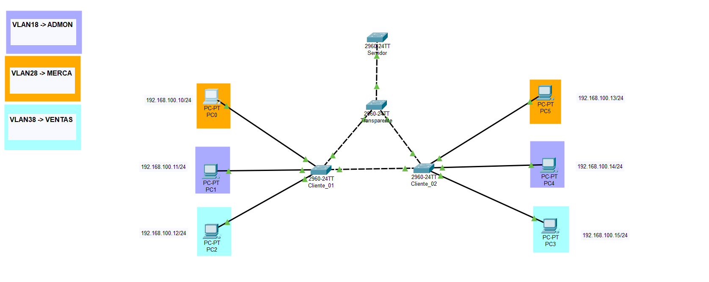
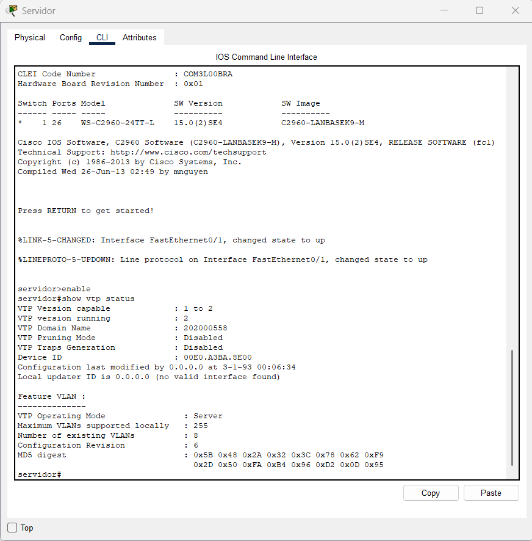
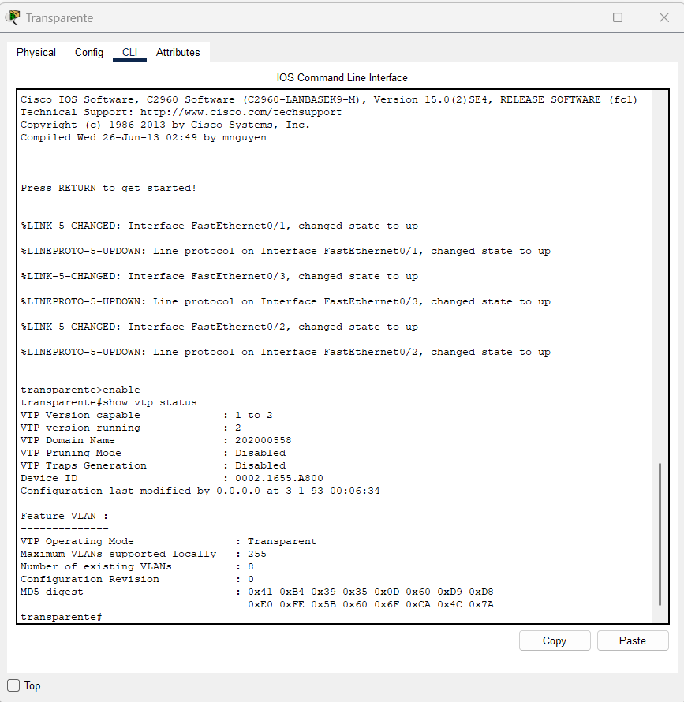
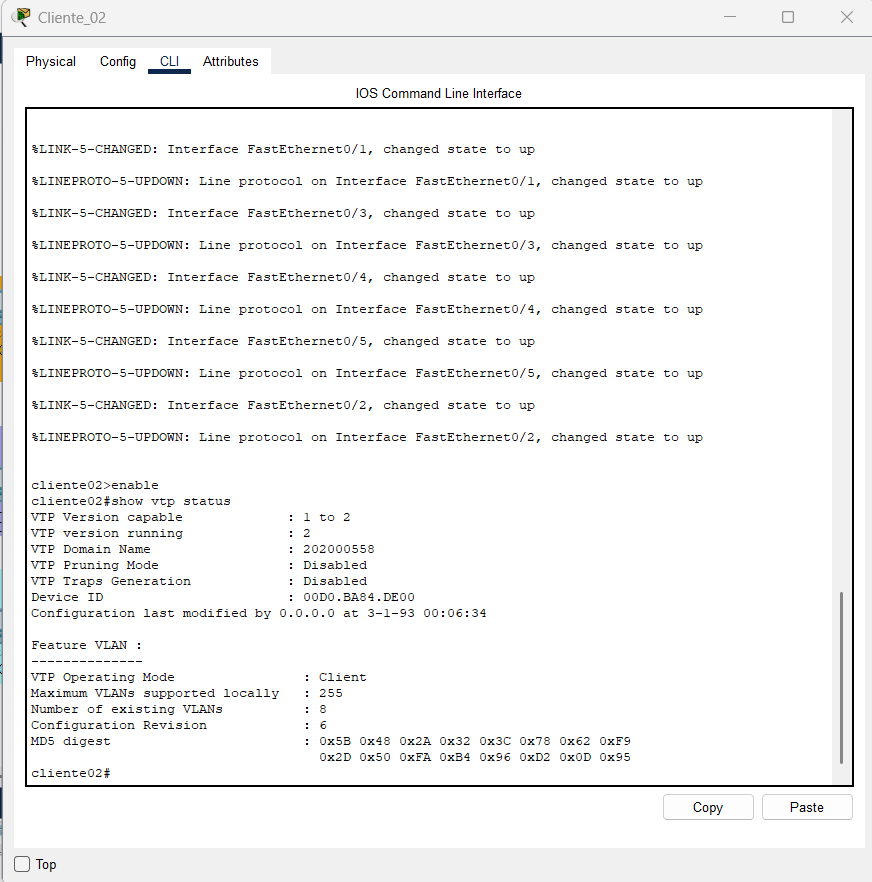
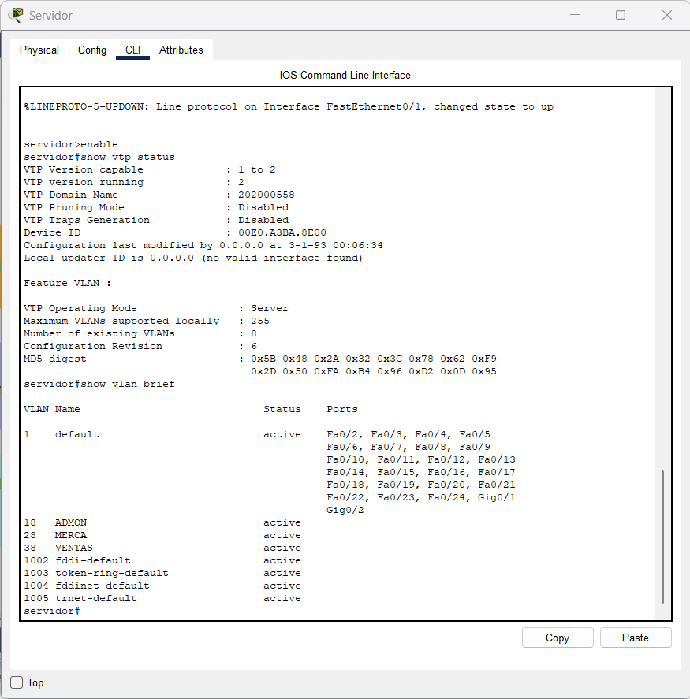
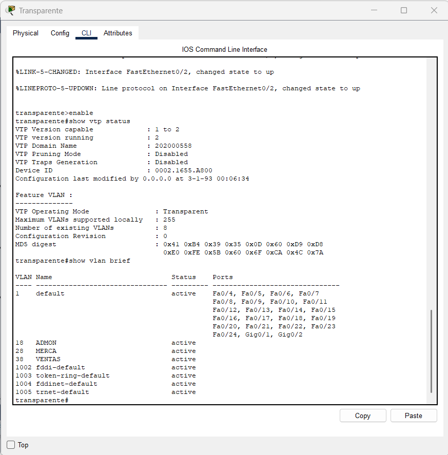
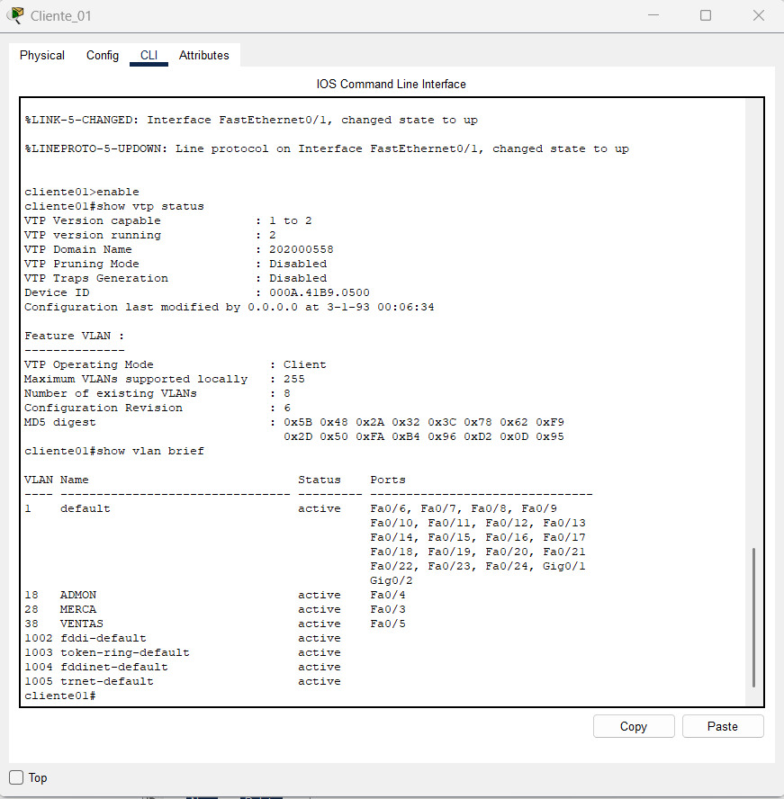
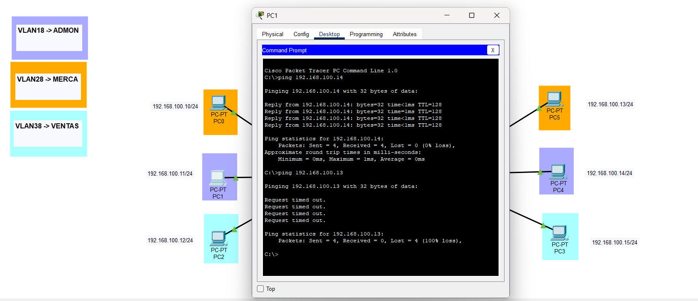
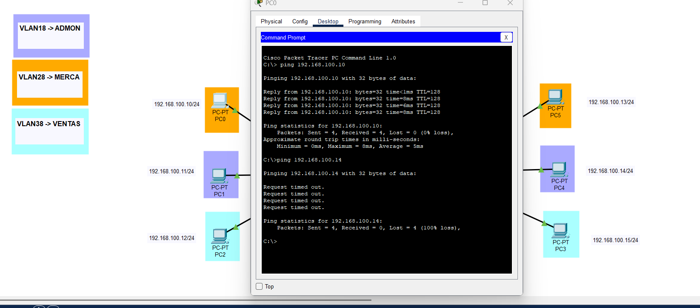
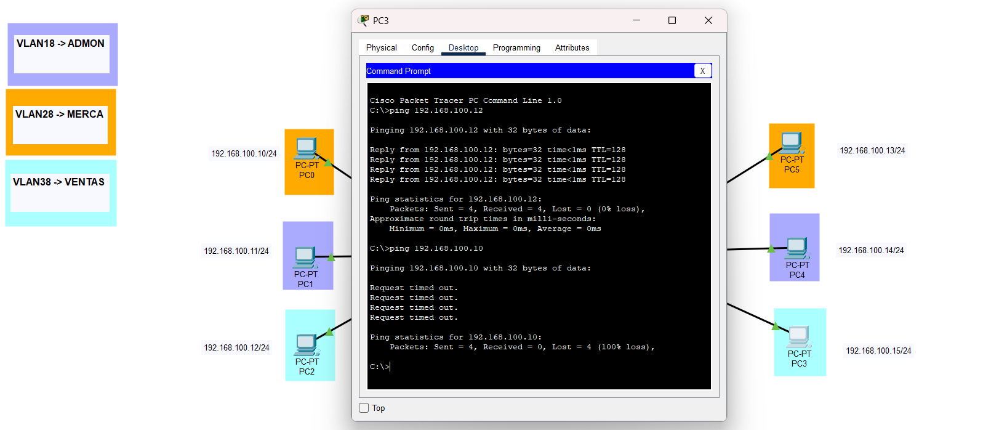

<h1 align="center">📌HOJA DE TRABAJO 01</h1>

<div align="center"> <strong>🖧 Redes de Computadoras 1</strong>  </div>
<div align="center"> 🏛 Universidad de San Carlos de Guatemala  </div>
<div align="center"> 📆 Primer Semestre - 2025  </div>

### MANUAL TECNICO

**Topología de la Red:** Se han implementado cuatro switches modelo 2960 para la configuración del protocolo VTP (VLAN Trunking Protocol) en una red de switches, permitiendo la propagación de VLANs de manera jerárquica.

La red está organizada con los siguientes switch:
  - Servidor: Configurado como VTP Server
  - Transparente: Configurado como VTP Transparent
  - Cliente01: Configurado como VTP Client
  - Cliente02: Configurado como VTP Client

<p align="center">
  
</p>

**Asignación de VLANs** Se han creado las siguientes VLANs para la segmentación de la red:

<table>
  <thead>
    <tr>
      <th>VLAN ID</th>
      <th>Nombre</th>
    </tr>
  </thead>
  <tbody>
    <tr>
      <td>18</td>
      <td>ADMON</td>
    </tr>
    <tr>
      <td>28</td>
      <td>MERCA</td>
    </tr>
    <tr>
      <td>38</td>
      <td>VENTAS</td>
    </tr>
  </tbody>
</table>

Cada PC ha sido asignada a una VLAN específica y cuenta con una dirección IP en la red 192.168.100.x/24 con máscara 255.255.255.0.


**Configuración de los Switches**
- Configuración del Switch Servidor
```
    enable
    configure terminal
    hostname Servidor
    vtp version 2
    vtp domain 202000558
    vtp password 202000558
    vtp mode server
    exit
    write memory
```

- Configuración del Switch Transparente
```
    enable
    configure terminal
    hostname Transparente
    vtp version 2
    vtp domain 202000558
    vtp password 202000558
    vtp mode transparent
    exit
    write memory
```

- Configuración de los Switches Cliente1 y 2
```
    enable
    configure terminal
    hostname ClienteX 
    vtp version 2
    vtp domain 202000558
    vtp password 202000558
    vtp mode client
    exit
    write memory
```


**Configuración de las VLANs**
- Las VLANs se crean en el switch Servidor y se propagan automáticamente a los clientes.
```
enable
configure terminal
vlan 18
name ADMON
vlan 28
name MERCA
vlan 38
name VENTAS
exit
write memory
```
**Configuración de Trunking**
- Los enlaces entre switches deben configurarse como trunks para permitir la propagación de VLANs.
```
enable
configure terminal
interface FastEthernet0/1
switchport mode trunk
switchport trunk allowed vlan 18,28,38
exit

interface FastEthernet0/2
switchport mode trunk
switchport trunk allowed vlan 18,28,38
exit
write memory
```

**Verificación de Configuración**
- Verificar VTP en los Switches
```
show vtp status
```
- Verificar VLANs en cada Switch
```
show vlan brief
```
- Verificar Trunking en los Switches
```
show interfaces trunk
```

### **Configuración**
#### **VTP en cada switch**
**Servidor:**
<p align="center">
  
</p>

**Transparente:**
<p align="center">
  
</p>

**Cliente01:**
<p align="center">
  
</p>

**Cliente02:**
<p align="center">
  
</p>

#### **Capturas de VLANs en cada switch**
**Servidor:**
<p align="center">
  
</p>

**Transparente:**
<p align="center">
  
</p>

**Cliente01:**
<p align="center">
  
</p>

**Cliente02:**
<p align="center">
  
</p>

#### **Pruebas de Conectividad (Ping)**
 - Ping en VLAN (ADMON)
<p align="center">
  
</p>

 - Ping en VLAN (MERCA)
<p align="center">
  
</p>

 - Ping en VLAN (VENTAS)
<p align="center">
  
</p>


