<h1 align="center">PRÁCTICA 01</h1>

<div align="center"> <strong>🖧 Redes de Computadoras 1</strong>  </div>
<div align="center"> 🏛 Universidad de San Carlos de Guatemala  </div>
<div align="center"> 📆 Primer Semestre - 2025  </div>

### MANUAL TECNICO

**Topología de la Red:** Se han implementado dos switches de capa 2 (modelo 2960) para conectar los departamentos de Sigma Studio. 

La red está organizada en cinco áreas:
  - Arquitectura y Urbanismo
  - Diseño Gráfico y Publicidad
  - Renderizado y Modelado 3D
  - Recepción y Administración
  - Alta Dirección

<p align="center">
  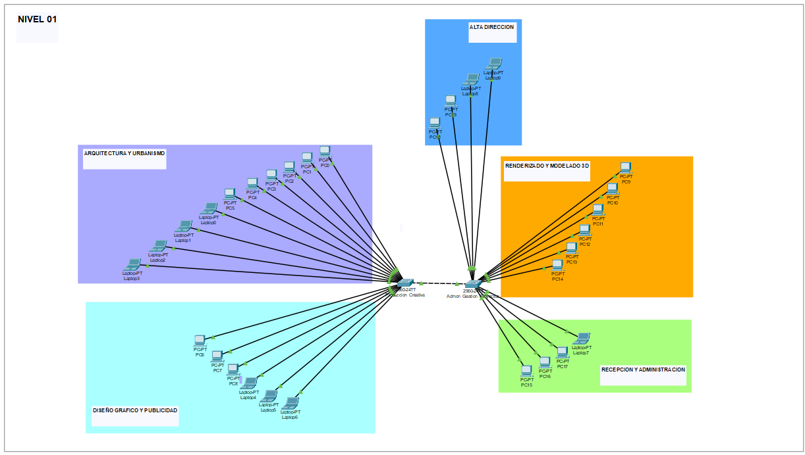
</p>


**Asignación de Direcciones IP:**
La red utiliza la dirección 192.168.58.0/24

<table>
  <thead>
    <tr>
      <th>Departamento</th>
      <th>Dispositivo</th>
      <th>Dirección IP</th>
    </tr>
  </thead>
  <tbody>
    <tr>
      <td rowspan="10"><b>Arquitectura y Urbanismo</b></td>
      <td>PC0</td>
      <td>192.168.58.2</td>
    </tr>
    <tr>
      <td>PC1</td>
      <td>192.168.58.3</td>
    </tr>
    <tr>
      <td>PC2</td>
      <td>192.168.58.4</td>
    </tr>
    <tr>
      <td>PC3</td>
      <td>192.168.58.5</td>
    </tr>
    <tr>
      <td>PC4</td>
      <td>192.168.58.6</td>
    </tr>
    <tr>
      <td>PC5</td>
      <td>192.168.58.7</td>
    </tr>
    <tr>
      <td>Laptop0</td>
      <td>192.168.58.8</td>
    </tr>
    <tr>
      <td>Laptop1</td>
      <td>192.168.58.9</td>
    </tr>
    <tr>
      <td>Laptop2</td>
      <td>192.168.58.10</td>
    </tr>
    <tr>
      <td>Laptop3</td>
      <td>192.168.58.11</td>
    </tr>
    <tr>
      <td rowspan="6"><b>Diseño Gráfico y Publicidad</b></td>
      <td>PC6</td>
      <td>192.168.58.12</td>
    </tr>
    <tr>
      <td>PC7</td>
      <td>192.168.58.13</td>
    </tr>
    <tr>
      <td>PC8</td>
      <td>192.168.58.14</td>
    </tr>
    <tr>
      <td>Laptop4</td>
      <td>192.168.58.15</td>
    </tr>
    <tr>
      <td>Laptop5</td>
      <td>192.168.58.16</td>
    </tr>
    <tr>
      <td>Laptop6</td>
      <td>192.168.58.17</td>
    </tr>
    <tr>
      <td rowspan="6"><b>Renderizado y Modelado 3D</b></td>
      <td>PC9</td>
      <td>192.168.58.18</td>
    </tr>
    <tr>
      <td>PC10</td>
      <td>192.168.58.19</td>
    </tr>
     <tr>
      <td>PC11</td>
      <td>192.168.58.20</td>
    </tr>
     <tr>
      <td>PC12</td>
      <td>192.168.58.21</td>
    </tr>
     <tr>
      <td>PC13</td>
      <td>192.168.58.22</td>
    </tr>
     <tr>
      <td>PC14</td>
      <td>192.168.58.23</td>
    </tr>
    <tr>
      <td rowspan="4"><b>Recepción y Administración</b></td>
      <td>Laptop7</td>
      <td>192.168.58.24</td>
    </tr>
    <tr>
      <td>PC17</td>
      <td>192.168.58.25</td>
    </tr>
    <tr>
      <td>PC16</td>
      <td>192.168.58.26</td>
    </tr>
    <tr>
      <td>PC15</td>
      <td>192.168.58.27</td>
    </tr>
    <tr>
      <td rowspan="4"><b>Alta Dirección</b></td>
      <td>PC18</td>
      <td>192.168.58.28</td>
    </tr>
    <tr>
      <td>PC19</td>
      <td>192.168.58.29</td>
    </tr>
        <tr>
      <td>Laptop8</td>
      <td>192.168.58.30</td>
    </tr>
        <tr>
      <td>Laptop9</td>
      <td>192.168.58.31</td>
    </tr>
  </tbody>
</table>


**Configuración de los Switches:**
- Switch prod (Producción Creativa)
```
    enable
    configure terminal
    hostname prod
    enable secret 202000558
    exit
    write memory
```

- Switch admon (Administración y Gestión de Proyectos)
```
    enable
    configure terminal
    hostname admon
    enable secret 202000558
    exit
    write memory
```

**Configuracion de las VPCs:**
<p align="center">
  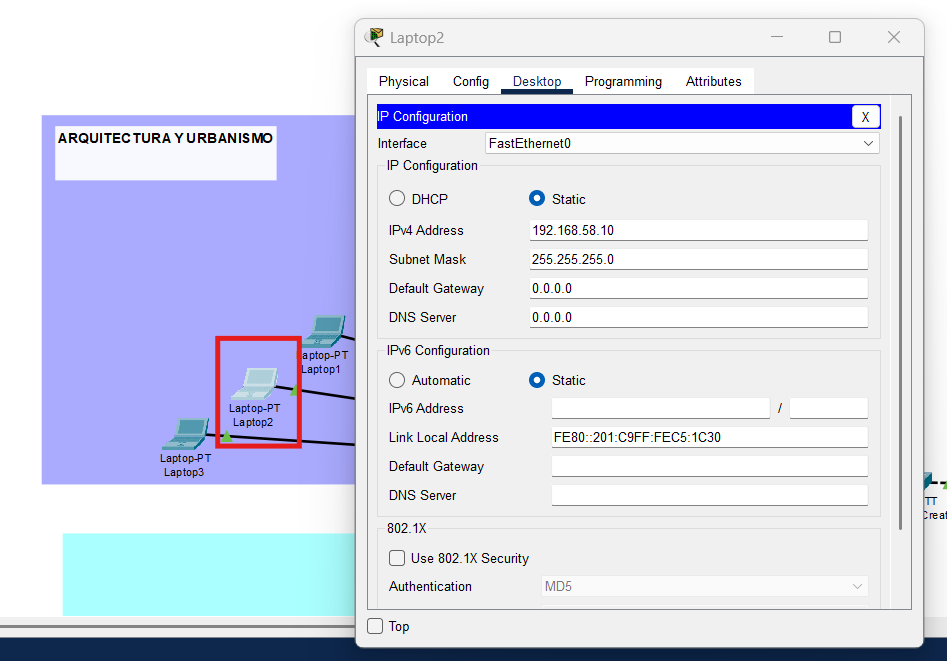
  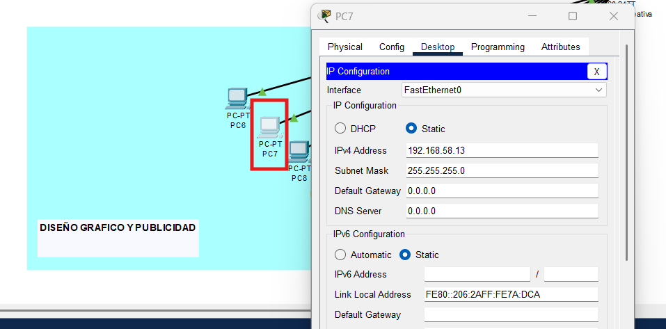
  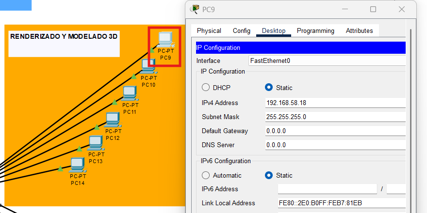
  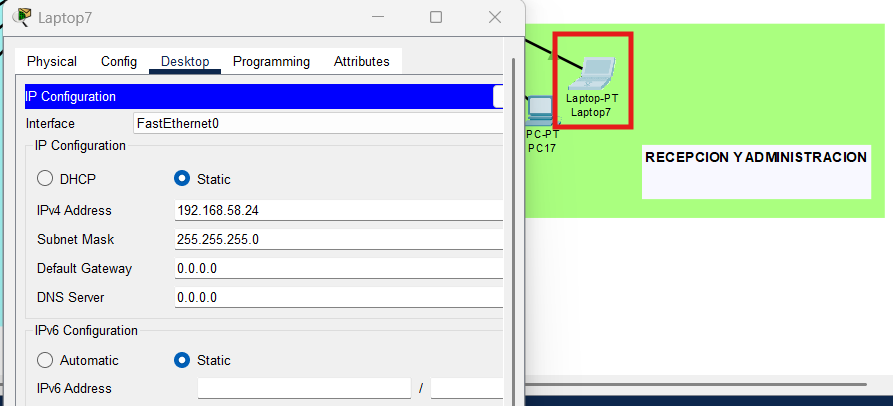
  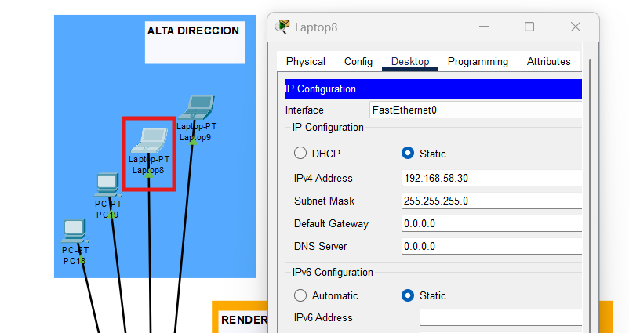
</p>


**Verificación de Conectividad:**
pruebas de ping entre hosts de diferentes áreas

<div align="center">
<table>
  <thead>
    <tr>
      <th>Desde</th>
      <th>Hacia (Área destino)</th>
      <th>Comando Ping</th>
    </tr>
  </thead>
  <tbody>
    <tr>
      <td>PC0 (Arquitectura y Urbanismo)</td>
      <td>PC6 (Diseño Gráfico y Publicidad)</td>
      <td><code>ping 192.168.58.12</code></td>
    </tr>
    <tr>
      <td>PC7 (Diseño Gráfico y Publicidad)</td>
      <td>PC9 (Renderizado y Modelado 3D)</td>
      <td><code>ping 192.168.58.18</code></td>
    </tr>
    <tr>
      <td>PC11 (Renderizado y Modelado 3D)</td>
      <td>Laptop7 (Recepción y Administración)</td>
      <td><code>ping 192.168.58.24</code></td>
    </tr>
    <tr>
      <td>PC15 (Recepción y Administración)</td>
      <td>PC18 (Alta Dirección)</td>
      <td><code>ping 192.168.58.28</code></td>
    </tr>
    <tr>
      <td>Laptop8 (Alta Dirección)</td>
      <td>PC1 (Arquitectura y Urbanismo)</td>
      <td><code>ping 192.168.58.3</code></td>
    </tr>
  </tbody>
</table>
</div>

<p align="center">
  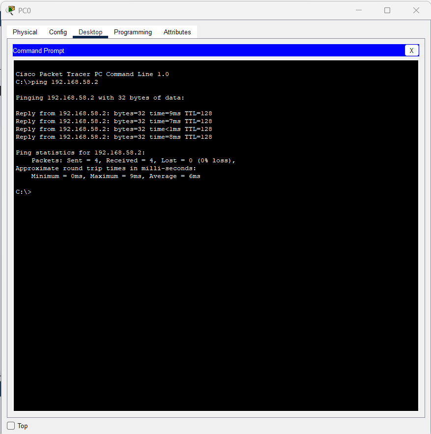
  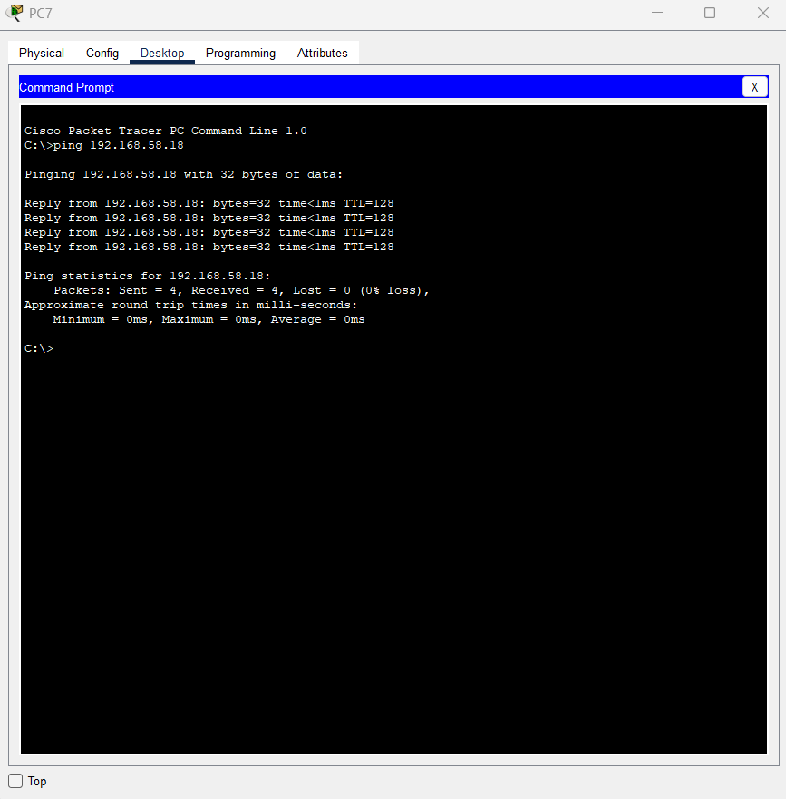
  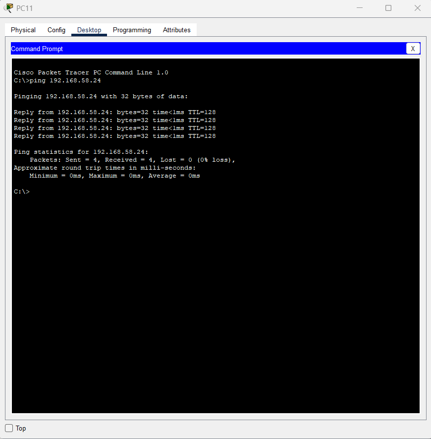
  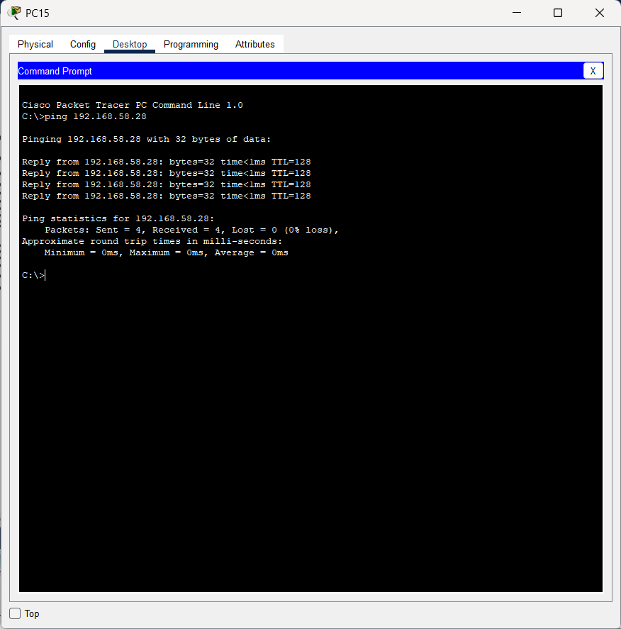
  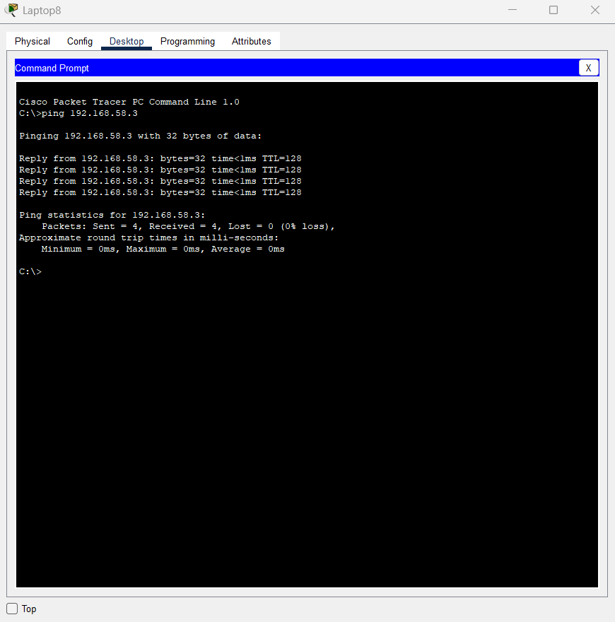
</p>


**Configuración de las VPCs:**

- paquete ARP
<p align="center">
  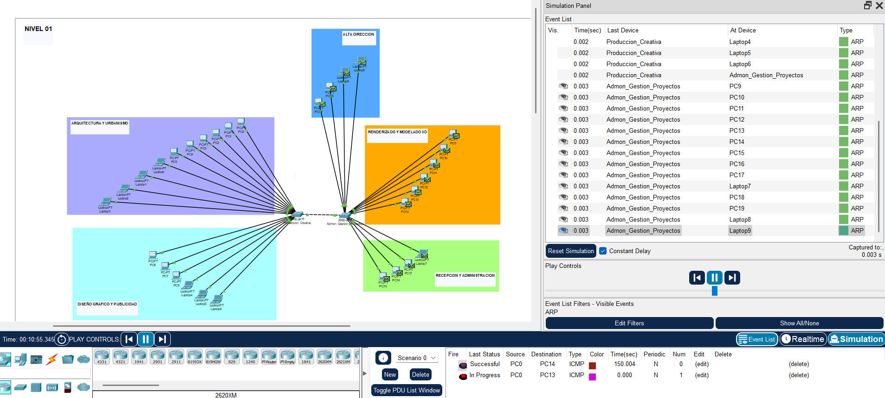
</p>

- paquete ICMP  
<p align="center">
  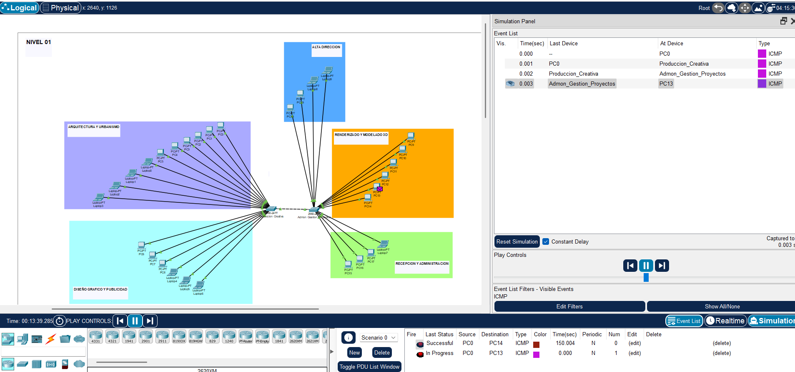
</p>

